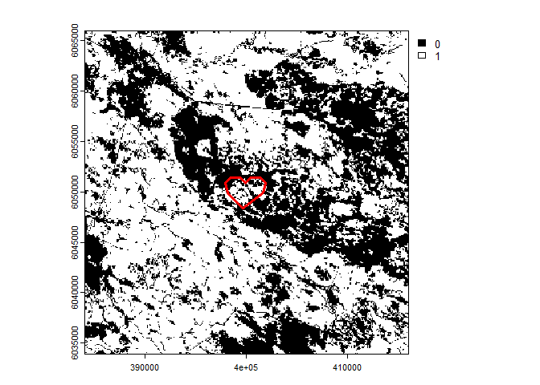
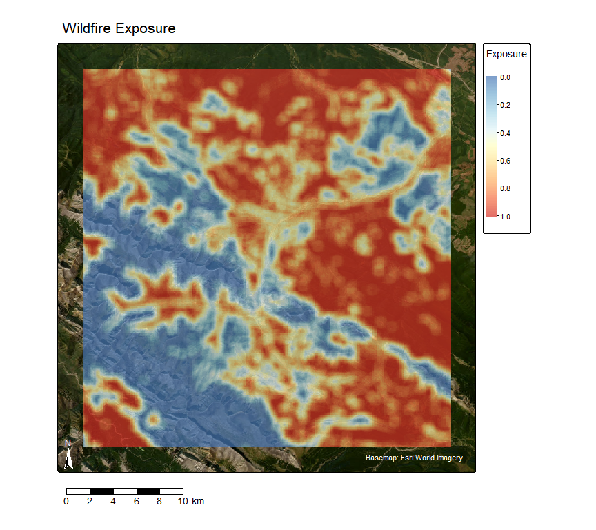
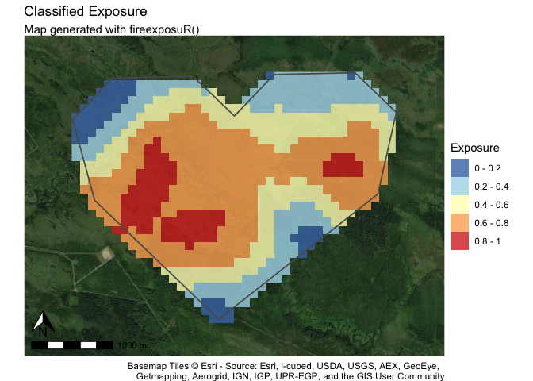
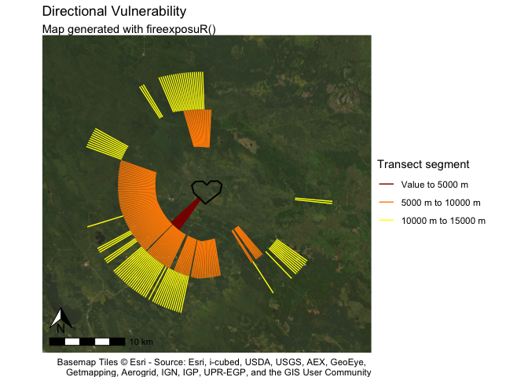

<!-- README.md is generated from README.Rmd. Please edit that file -->

# fireexposuR

<!-- badges: start -->

[](https://github.com/heyairf/fireexposuR/actions/workflows/R-CMD-check.yaml)

[](https://www.repostatus.org/#wip)

[](https://github.com/ropensci/software-review/issues/659)

<!-- badges: end -->

`firexposuR` is an R package for computing and visualizing wildfire
exposure. The outputs from wildfire exposure assessments can be utilized
as decision support tools for wildfire management across variable
temporal horizons and spatial extents.

> **An important note for current (and past) Prometheus users**
>
> If Prometheus has *ever* been installed on your device you must take
> some additional steps before loading this package (and most other R
> packages that manipulate spatial data). Please go through the steps in
> `vignette("prometheus")` before continuing. **This is necessary even
> if you have since uninstalled the program from your computer.**

## Package overview

- provides an accessible platform for conducting wildfire exposure
  assessments
- automates methods previously documented in a series of scientific
  publications
- provides options for customization and validation to meet the needs of
  users applying the package across diverse use cases and geographic
  areas

### Who the package is for

This package is for anyone who is interested in conducting wildfire
exposure assessments. This can include, but is not limited to,
researchers, government agencies, forest industry, consultants,
communities, and interested individuals.

User’s without pre-existing knowledge of wildland fuels, spatial data,
and R may need to dedicate more time and effort to learning how to apply
the tools in this package by exploring the included documentation and
linked resources.

### What the package does

1.  Automates published methodologies

This package was developed to automate the methods published in a series
of scientific publications. Replicating the methods from a scientific
publication can be challenging; it can require a significant amount of
time and experience which can be a barrier to access.

2.  Provides an accessible platform

This package and the code within it will always be free. Financial costs
can also be a significant barrier to conducting wildfire risk
assessments. Though this package is free to use there are still
associated time costs, which will vary based on experience level. Even
novice R users should have enough resources to conduct their own
wildfire exposure assessments by referencing the documentation in this
package and the plethora of free R tutorials available online.

3.  Visualizes outputs

The outputs from the analysis functions can be quickly visualized in R
with a selection of visualization functions that return plots, maps, or
tables which can be exported as images or .csv files.

4.  Allows customization

Functions allow for custom parameterization to alter the analysis if
desired. This allows for easy adaptation of the methods to suit the
unique requirements for different use cases, geographic areas, and
scales of analysis.

### What the package doesn’t

1.  Let you skip the hard part (understanding the theory)

Effort has been made to provide as much technical detail in the
documentation of this package; However, it may still be necessary to
spend some time reading the associated scientific publications that the
functions in this package are automating to grasp the theory behind the
methodologies. Citations have been provided with DOI links throughout
this manual. This is especially relevant to users who intend to adjust
function parameters.

2.  Prepare your input data

Methods in wildfire exposure are adaptable to different applications and
scales. This means that the input data requirements are dependent on the
intended purpose. The user is responsible for preparing the input data
before using this package. Input data can be prepared in any geographic
information system (GIS) program, or done directly in R. Refer to
`vignette("prep-input-data")` for guidance and examples.

3.  Decide custom parameters

The documentation and resources available in this package aim to help
inform decisions around custom parameterization, but these decisions
must be made by the user. Additional analysis may be required to justify
deviation from the defaults.

4.  Quality check your outputs

The functions in the fireexposuR package are sensitive to the input data
and parameters used. It is the users responsibility to ensure that the
outputs from the fireexposuR package are quality checked before use in
decision support or further analysis.

## Installation

You can install the development version of fireexposuR from
[GitHub](https://github.com/) with:

``` r
# install.packages("devtools")
devtools::install_github("heyairf/fireexposuR")
```

## Usage example

This example shows a basic workflow to assess the long-range ember
exposure and directional vulnerability for an area of interest.

### Input data

``` r
# load the fireexposuR library
library(fireexposuR)

# load the terra library for spatial data functions
library(terra)
#> terra 1.7.78

# read example hazard data
hazard_file_path <- "extdata/hazard.tif"
hazard <- terra::rast(system.file(hazard_file_path, package = "fireexposuR"))

# read example polygon geometry for area of interest boundary
geom_file_path <- "extdata/polygon_geometry.csv"
geom <- read.csv(system.file(geom_file_path, package = "fireexposuR"))

# use geometry to make an area of interest polygon
aoi <- terra::vect(as.matrix(geom), "polygons", crs = hazard)
```

The `hazard` layer is a binary raster where a value of 1 represents
wildland fuels that have the potential to generate long-range embers (a
transmission distance of up to 500 meters).

The `aoi` layer is a polygon representing a localized area of interest
(e.g., the built environment of a community, a sensitive habitat, a
campground, etc.) shown in red.



### Compute exposure

``` r
# compute long-range ember exposure by setting transmission distance to "l"
exposure <- fire_exp(hazard, tdist = "l")

# compute directional exposure toward the value with default parameters
dir_exposure <- fire_exp_dir(exposure, aoi)
```

These objects can be exported using the terra library if the user
prefers visualizing and conducting further analysis outside of the R
environment (e.g. a GIS). - The `exposure` layer can be exported as a
raster - The `dir_exposure` layer can be exported as a shapefile

### Visualize exposure

The outputs can also be visualized directly in R with the fireexposuR
package.

``` r
# map the full extent of the exposure raster with a continuous scale
fire_exp_map_cont(exposure)
```



``` r

# map exposure classes within the area of interest with a base map
fire_exp_map_class(exposure, aoi, classify = "landscape", zoom_level = 13)
```



``` r

# map the directional exposure transects toward the area of interest
fire_exp_dir_map(dir_exposure, aoi)
```



## Further reading and resources

[wildfireanalytics.org](https://wildfireanalytics.org)

- Wildfire exposure research news and course offering announcements

FireSmart Canada (2018) Wildfire exposure assessment guidebook.
Available
[here](https://firesmartcanada.ca/wp-content/uploads/2022/01/FS_ExposureAssessment_Sept2018-1.pdf)

- This guidebook provides a basic and easy to read overview of wildfire
  exposure assessments with very helpful graphics

Beverly JL, Bothwell P, Conner JCR, Herd EPK (2010) Assessing the
exposure of the built environment to potential ignition sources
generated from vegetative fuel. *International Journal of Wildland Fire*
**19**, 299-313. [DOI](https://doi.org/10.1071/WF09071)

- Introduced wildfire exposure methods and wildfire transmission
  distances for community scale assessments

Beverly JL, McLoughlin N, Chapman E (2021) A simple metric of landscape
fire exposure. *Landscape Ecology* **36**, 785-801.
[DOI](https://doi.org/10.1007/s10980-020-01173-8)

- Validation of the wildfire exposure metric at a landscape scale with
  observed fire history in the province of Alberta, Canada

Beverly JL, Forbes AM (2023) Assessing directional vulnerability to
wildfire. *Natural Hazards* **117**, 831-849.
[DOI](https://doi.org/10.1007/s11069-023-05885-3)

- Introduces the directional exposure assessment methodology

Kim AM, Beverly JL, Al Zahid A (2024) Directional analysis of community
wildfire evacuation capabilities. *Safety Science* **171**, 106378.
[DOI](https://doi.org/10.1016/j.ssci.2023.106378)

- Application of directional vulnerability assessments for analyzing
  evacuation capabilities for communities

Schmidt JI, Ziel RH, Calef MP, Varvak A (2024) Spatial distribution of
wildfire threat in the far north: exposure assessment in boreal
communities. *Natural Hazards* **120**, 4901-4924.
[DOI](https://doi.org/10.1007/s11069-023-06365-4)

- Application of wildfire exposure assessments in Alaska, USA using
  alternative methods to define hazardous fuels

Forbes AM, Beverly JL (2024) Influence of fuel data assumptions on
wildfire exposure assessment of the built environment. *International
Journal of Wildland Fire* **33**, WF24025
[DOI](https://doi.org/10.1071/WF24025)

- Investigates the sensitivity of wildfire exposure assessments to
  different land cover information products used to create the input
  hazardous fuel data at local scales
