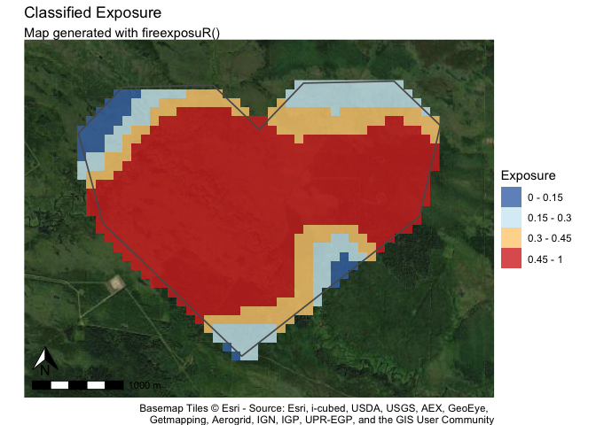

<!-- README.md is generated from README.Rmd. Please edit that file -->

# fireexposuR

<!-- badges: start -->

[](https://github.com/heyairf/fireexposuR/actions/workflows/R-CMD-check.yaml)

[](https://www.repostatus.org/#wip)

[](https://github.com/ropensci/software-review/issues/659)

<!-- badges: end -->

`firexposuR` is an R package for computing and visualizing wildfire
exposure. The outputs from wildfire exposure assessments can be utilized
as decision support tools for wildfire management across variable
temporal horizons and spatial extents.

> **An important note for current (and past) Prometheus users**
>
> If Prometheus has *ever* been installed on your device you must take
> some additional steps before loading this package (and most other R
> packages that manipulate spatial data). Please refer to the vignette
> “Prometheus users” before continuing. **This step is necessary even if
> you have since uninstalled the program from your computer.**

## Package overview

- provide an accessible platform for conducting wildfire exposure
  assessments
- automate methods previously documented in a series of scientific
  publications
- provide options for customization and validation to meet the needs of
  users applying the package across diverse use cases and geographic
  areas

### Who the package is for

gfad

### What the package does

1.  Automates published methodologies

This package was developed to automate the methods published in a series
of scientific publications. Replicating the methods from a scientific
publication can be challenging; it can require a significant amount of
time and experience which can be a barrier to access.

2.  Provides an accessible platform

This package and the code within it will always be free. Financial costs
can also be a significant barrier to conducting wildfire risk
assessments. Though this package is free to use there are still
associated time costs, which will vary based on experience level. Even
novice R users should have enough resources to conduct their own
wildfire exposure assessments by referencing the documentation in this
package and the plethora of free R tutorials available online.

3.  Visualizes outputs

4.  Allows customization

### What the package doesn’t

1.  Let you skip the hard part (understanding the theory)

Effort has been made to provide as much technical detail in the
documentation of this package; However, it may still be necessary to
spend some time reading the associated scientific publications that the
functions in this package are automating to grasp the theory behind the
methodologies. Citations have been provided with linked DOI’s throughout
this manual. This is especially relevant to users who intend to adjust
the parameter settings from the defaults.

2.  Prepare your input data

Methods in wildfire exposure are adaptable to different applications and
scales. This means that the input data requirements are dependent on the
intended purpose. The user is responsible for preparing the input data
before using this package. Input data can be prepared in any geographic
information system (GIS) program, or done directly in R. Refer to the
vignette “Preparing input data” for guidance and examples.

3.  Decide your custom parameters

4.  Quality check your outputs

**DOCUMENTATION IN DEVELOPMENT**

The goal of fireexposuR is to provide a standardized and accessible
platform for the computation and analysis of wildfire exposure. Wildfire
exposure assessments are a decision support tool in wildfire management
and can be applied for multiple temporal horizons and spatial extents.
This package automates the methods previously documented in a series of
scientific publications.

## Installation

You can install the development version of fireexposuR from
[GitHub](https://github.com/) with:

``` r
# install.packages("devtools")
devtools::install_github("heyairf/fireexposuR")
```

## Usage example

This is a basic example which shows a basic workflow to assess the
long-range ember exposure for an area of interest.

### Input data

``` r
# load the fireexposuR library
library(fireexposuR)

# load terra for spatial data functions
library(terra)
#> terra 1.7.78

# read example hazard data
hazard_file_path <- "extdata/hazard.tif"
hazard <- terra::rast(system.file(hazard_file_path, package = "fireexposuR"))

# read example polygon geometry for area of interest boundary
geom_file_path <- "extdata/polygon_geometry.csv"
geom <- read.csv(system.file(geom_file_path, package = "fireexposuR"))

# use geometry to make an area of interest polygon
aoi <- terra::vect(as.matrix(geom), "polygons", crs = hazard)
```

The `hazard` layer is a binary raster where a value of 1 represents
wildland fuels that have the potential to generate long-range embers (a
transmission distance of up to 500 meters).

The `aoi` layer is a polygon representing a localized area of interest
(e.g., the built environment of a community, a sensitive habitat, a
campground, etc.) shown in red.


### Compute exposure

``` r
# compute long-range ember exposure by setting transmission distance to "l"
exposure <- fire_exp(hazard, tdist = "l")

# compute directional exposure toward the value with default parameters
dir_exposure <- fire_exp_dir(exposure, aoi)
```

These objects can be exported using the terra library if the user
prefers visualizing and conducting further analysis outside of the R
environment (e.g. a GIS). - The `exposure` layer can be exported as a
raster - The `dir_exposure` layer can be exported as a shapefile

### Visualize exposure

The outputs can also be visualized directly in R with the fireexposuR
package.

``` r
# map the full extent of the exposure raster with a continuous scale
fire_exp_map_cont(exposure)
```


``` r

# map exposure classes within the area of interest with a base map
fire_exp_map_class(exposure, aoi, zoom_level = 13)
```



``` r

# map the directional exposure transects toward the area of interest
fire_exp_dir_map(dir_exposure, aoi)
```

 \##
Further reading

- [Beverly et al. 2010](https://doi.org/10.1071/WF09071)
  - Introduces wildfire exposure and wildfire transmission distances for
    community scale assessments
- [Beverly et al. 2021](https://doi.org/10.1007/s10980-020-01173-8)
  - Validation of the wildfire exposure metric at a landscape scale with
    observed fire history
- [Beverly and Forbes 2023](https://doi.org/10.1007/s11069-023-05885-3)
  - Directional vulnerability assessment and methodology
