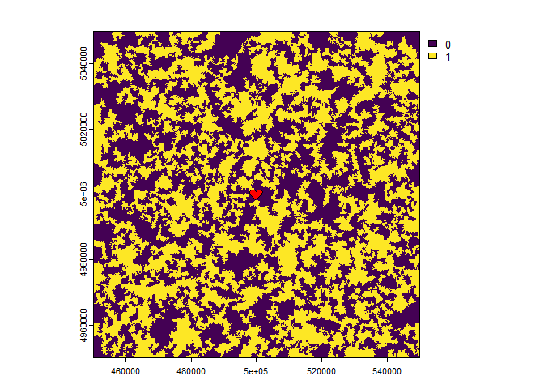
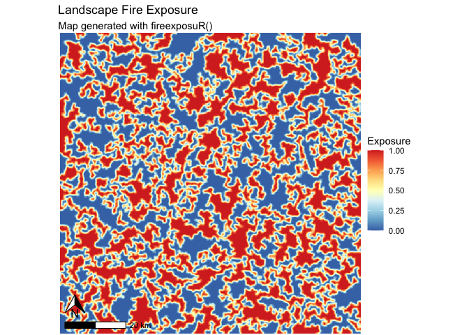
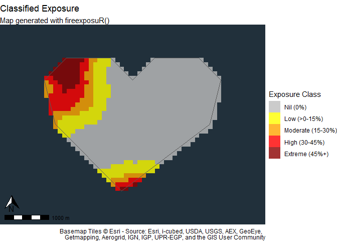

<!-- README.md is generated from README.Rmd. Please edit that file -->

# fireexposuR

<!-- badges: start -->

[](https://www.repostatus.org/#wip)

[](https://github.com/heyairf/fireexposuR/actions/workflows/R-CMD-check.yaml)

[](https://github.com/ropensci/software-review/issues/659)

<!-- badges: end -->

The goal of fireexposuR is to provide a standardized and accessible
platform for the computation and analysis of wildfire exposure. Wildfire
exposure assessments are a decision support tool in wildfire management
and can be applied for multiple temporal horizons and spatial extents.
This package automates the methods previously documented in a series of
scientific publications.

- [Beverly et al. 2010](https://doi.org/10.1071/WF09071)
  - Introduces wildfire exposure and wildfire transmission distances for
    community scale assessments
- [Beverly et al. 2021](https://doi.org/10.1007/s10980-020-01173-8)
  - Validation of the wildfire exposure metric at a landscape scale with
    observed fire history
- [Beverly and Forbes 2023](https://doi.org/10.1007/s11069-023-05885-3)
  - Directional vulnerability assessment and methodology

The functions in this package require the pre-preparation of data; an
accompanying paper (currently in preparation) details suggestions for
data acquisition and preparation in accordance with various budget
limitations and user experience levels. The initial release of the
package provides a collection of functions that assist users with
conducting wildfire exposure and directional vulnerability assessments
for values and landscapes, and includes methods for validating the
metric for an area of interest. Outputs from the functions include
spatial data, tables, graphics, and maps that can be further analyzed or
modified directly in R or exported for use in other applications.

## Installation

You can install the development version of fireexposuR from
[GitHub](https://github.com/) with:

``` r
# install.packages("devtools")
devtools::install_github("heyairf/fireexposuR")
```

## Usage example

This is a basic example which shows a workflow to assess wildfire
exposure on a landscape and within an area of interest.

### Data preparation

First, some example data will be generated:

``` r
library(terra)
#> terra 1.7.83
library(fireexposuR)
# read example hazard data ---------------------------------
filepath <- "extdata/hazard.tif"
haz <- rast(system.file(filepath, package = "fireexposuR"))
# read example AOI polygon ---------------------------------
filepath <- "extdata/builtsimpleexamplegeom.csv"
g <- read.csv(system.file(filepath, package = "fireexposuR"))
aoi <- vect(as.matrix(g), "polygons", crs = haz)
# ----------------------------------------------------------
```

#### Hazard data

The `haz` layer is a binary raster that represents wildland fuels that
have the potential to generate embers up to a distance of 500 meters
with a value of 1.

#### Area of interest

The `aoi` layer is a polygon representing a localized area of interest
(e.g., the built environment of a community, a sensitive habitat, a
campground, etc.) shown in red.



### Compute exposure

Now, we will use the hazard data to compute the exposure to long-range
ember transmission.

``` r
library(fireexposuR)
exp <- fire_exp(haz, tdist = "l")
```

### Visualize exposure

Once we have an exposure raster the rest of the package functions can be
used to visualize it in different ways. For a landscape, we can map
exposure with a continuous scale with `fire_exp_map_cont()`:

``` r
fire_exp_map_cont(exp)
#> <SpatRaster> resampled to 501264 cells.
```



We can also see how that exposure is distributed within a localized area
of interest with exposure classifications using `fire_exp_map_class()`.
Now we can see that within our area of interest the northwest corner is
a potential entry point for long-range embers from the landscape.

Note: our imaginary area of interest is in the middle of the Pacific
Ocean so the base map does not provide further reference.

``` r
fire_exp_map_class(exp, classify = "local", aoi)
```


