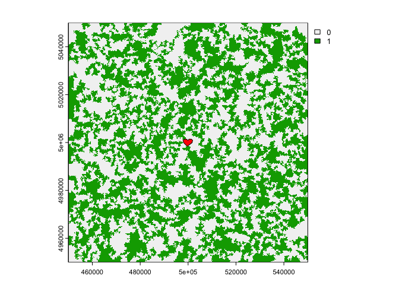
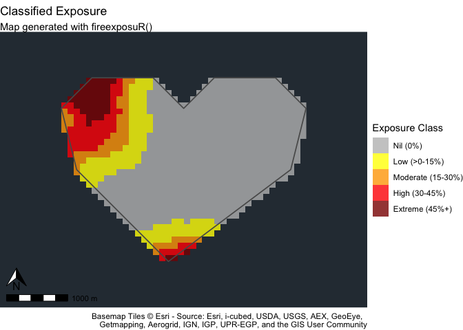
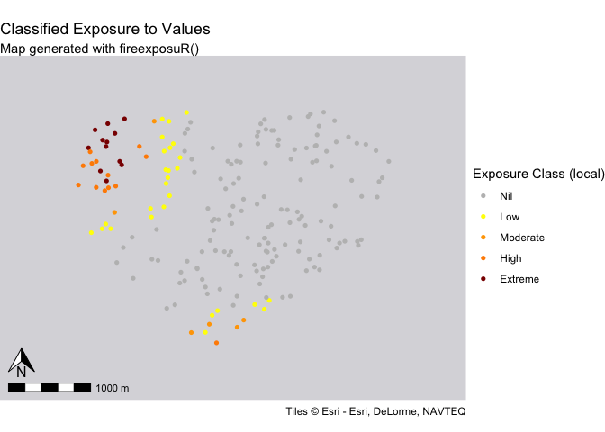
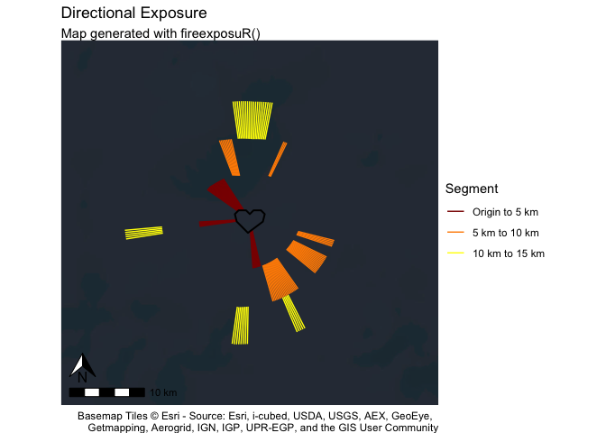

<!-- README.md is generated from README.Rmd. Please edit that file -->

# fireexposuR

<!-- badges: start -->

[](https://www.repostatus.org/#wip)

<!-- badges: end -->

The goal of fireexposuR is to provide a standardized and accessible
platform for the computation and analysis of wildfire exposure. Wildfire
exposure assessments are a decision support tool in wildfire management
and can be applied for multiple temporal horizons and spatial extents.
This package automates the methods previously documented in a series of
scientific publications.

- [Beverly et al. 2010](https://doi.org/10.1071/WF09071)
- [Beverly et al. 2021](https://doi.org/10.1007/s10980-020-01173-8)
- [Beverly and Forbes 2023](https://doi.org/10.1007/s11069-023-05885-3)

The functions in this package require the pre-preparation of data; an
accompanying paper details suggestions for data acquisition and
preparation in accordance with various budget limitations and user
experience levels. The initial release of the package provides a
collection of functions that assist users with conducting wildfire
exposure and directional vulnerability assessments for values and
landscapes, and includes methods for validating the metric for an area
of interest. Outputs from the functions include spatial data, tables,
graphics, and maps that can be further analyzed or modified directly in
R or exported for use in other applications.

## Installation

You can install the development version of fireexposuR from
[GitHub](https://github.com/) with:

``` r
# install.packages("devtools")
devtools::install_github("heyairf/fireexposuR")
```

## Usage example

This is a basic example which shows a workflow to assess wildfire
exposure on a landscape and within an area of interest.

### Data preperation

First, some example data will be generated:

``` r
library(terra)
#> terra 1.7.71
# generate example hazard data -----------------------------
set.seed(0)
e <- c(45,55,495,505) * 10000
r <- rast(resolution = 100, extent = ext(e))
values(r) <- sample(c(0,1), ncell(r), replace = TRUE)
crs(r) <- "EPSG:32608"
r <- sieve(r, threshold = 50, directions = 4)
haz <- sieve(r, threshold = 500, directions = 4)
# generate example AOI polygon -----------------------------
filepath <- "extdata/builtsimpleexamplegeom.csv"
g <- read.csv(system.file(filepath, package = "fireexposuR"))
m <- as.matrix(g)
aoi <- vect(m, "polygons", crs = haz)
# ----------------------------------------------------------
```

#### Hazard data

The `haz` layer is a binary raster that represents wildland fuels that
are able to generate long-range embers up to a transmission distance of
500 meters with a value of 1.

#### Area of interest

The `aoi` layer is a polygon representing a localized area of interest
(e.g., the built environment of a community, a sensitive habitat, a
campground, etc.) shown in red.



### Compute exposure

Now, we will use the hazard data to compute the exposure to long-range
ember transmission.

``` r
library(fireexposuR)
exp <- exposure(haz, tdist = "l")
```

### Visualize exposure

Once we have an exposure raster the rest of the package functions can be
used to visualize it in different ways. For a landscape, we can map
exposure with a continuous scale with `mapexpcont()`:

``` r
mapexpcont(exp)
#> <SpatRaster> resampled to 501264 cells.
```


We can also see how that exposure is distributed within a localized area
of interest with exposure classifications using `mapexpclass()`. Now we
can see that within our area of interest the northwest corner is a
potential entry point for long-range embers from the landscape.

Note: our imaginary area of interest is in the middle of the Pacific
Ocean so the base map does not provide further reference.

``` r
mapexpclass(exp, classify = "local", aoi)
```


<<<<<<< HEAD
=======

This map gives us a better understanding of areas of the town that could
be fire entry points. We can also summarize the area with `summexp()` if
we want to know the proportional distributions of each class.

``` r
summexp(exp, classify = "local", aoi)
#>      class npixels       prop  aream2 areaha
#> 1      Nil     595 0.70749108 5950000    595
#> 2      Low      90 0.10701546  900000     90
#> 3 Moderate      54 0.06420927  540000     54
#> 4     High      58 0.06896552  580000     58
#> 5  Extreme      44 0.05231867  440000     44
```

We also have data for the values within the built environment, for which
we can map or summarize in a table as well.

``` r
# map the values
extractexp(exp, pts, classify = "local", map = TRUE)
```



``` r
# summary table 
extractexp(exp, pts, classify = "local", summary = TRUE)
#>      class   n  prop
#> 1      Nil 142 0.710
#> 2      Low  27 0.135
#> 3 Moderate   6 0.030
#> 4     High  13 0.065
#> 5  Extreme  12 0.060
```

With this information, the community has now identified 12 structures
that are extremely exposed to long-range embers from the landscape in
the northwest of the community. This could be a potential area to
prioritize wildfire mitigation strategies.

#### Directional vulnerability

Our make believe town may also wish to assess the directional
vulnerability to wildfire towards their community. This assessment
identifies linear pathways of exposure from the landscape toward a
value.

Note: our imaginary town is in the middle of the Pacific Ocean so the
base map does not provide further reference.

``` r
direxp(exp, aoi, map = TRUE)
#> <SpatRaster> resampled to 501120 cells.
```



Now we can see that although the northwest corner of the town is a
potential entry point, the pathway to that location is only viable from
5 kilometers out. The southeast pathway might be a more concerning
pathway because it covers the full 15 kilometers. Depending on local
knowledge, this assessment could identify further areas of concern. For
example, if the region has consistent patterns of southwest winds it may
be a priority area for fuel reduction treatments. Or perhaps there is a
popular outdoor recreation area to the northwest close to the community,
in which case the shorter pathway might be more concerning if there is
increased human ignition potential in that area.
>>>>>>> c6c2262e18f136e87f06c245a49cc5934e660c78
