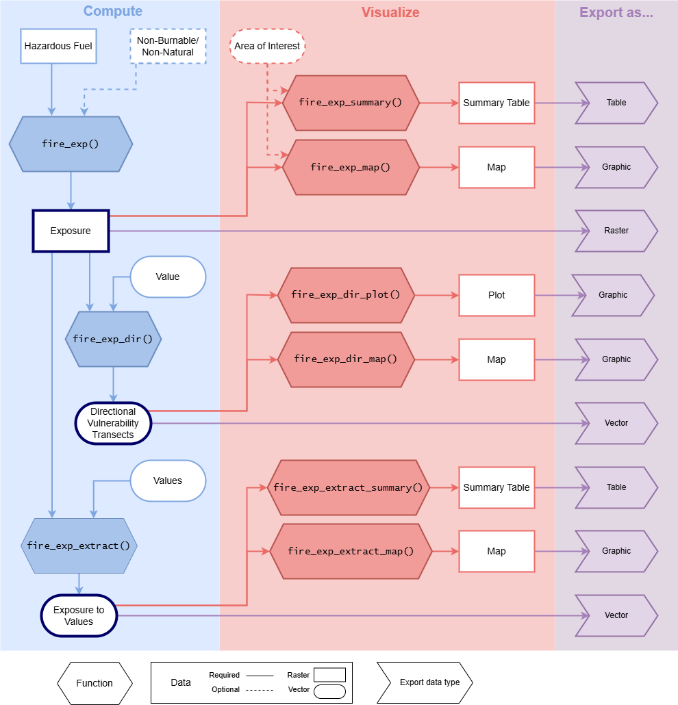

```{r, include = FALSE}
knitr::opts_chunk$set(
  collapse = TRUE,
  comment = "#>",
  warning = FALSE, message = FALSE
)
```

This document aims to guide users through the functionality of this package for different use cases. After reading this page, the user should be able to determine the input data they will require to apply the functions in this package. 

## Spatial data in R

The spatial operations in *fireexposuR* are done using the `{terra}` package (Hijmans 2024). If you have not worked with spatial data in the R environment before it is a good idea to take some time to read the documentation there to understand the spatial datatypes required in this package. There are many useful tutorials at <https://rspatial.org>. At a minimum, I recommend reading the documentation for the following functions: 

-  Reading spatial data: [`terra::vect()`] and [`terra::rast()`]
-  Writing spatial data: [`terra::writeVector()`] and [`terra::writeRaster()`]

## 1. Determine scale

First, consider what scale(s) of wildfire transmission you are interested in assessing. Methods in wildfire exposure can be applied for various scales of wildfire transmission. Input data requirements will vary depending on the scale of assessment.

### Landscape

Landscape scale wildfire exposure assessments are concerned with large, and often fast, wildfire ignition potential in natural wildland fuels. These assessments can be conducted for large extents (e.g., country (Khan et al. 2025), province (Beverly et al. 2021), state (Schmidt et al. 2024)) or focused near a value of interest (e.g., a community buffer (Beverly and Forbes 2023; Kim et al. 2023)). Only fuels that have the potential to produce long-range embers are considered for landscape scale exposure assessments. 

### Local

Local scale wildfire exposure assessments can also incorporate shorter transmission distances. Local scale assessments can be used to understand values are exposed to surrounding wildland fuels. This includes long-range ember exposure, but can also incorporate shorter wildfire transmission distances like short-range embers or radiant heat exposure.

### Understanding transmission distances

The defaults for the wildfire transmission distances are based on Beverly et al. (2010) and Beverly et al. (2021). 

#### Long-range embers 

The transmission distance for long-range embers is defined as 500 meters. In reality, under extreme conditions some wildland fuels have the potential to transmit long-range embers at distances much greater than 500 meters; However, this value has been validated for the exposure metric in Alberta (Beverly et al. 2021), Alaska (Schmidt et al. 2024), Portugal (Khan et al. 2025), and across the entire Canadian landbase (manuscript in preparation). 

#### Short-range embers and radiant heat

The transmission distance for short-range embers is defined as 100 meters and the transmission distance for radiant heat transmission is defined as 30 meters. Some wildland fuels have the potential transmit fire over shorter distances, but are less likely to contribute to landscape scale processes.

## 2. Determine scope

Second, consider which analyses you are interested in using the package for. Determining the scope will inform the required spatial resolution and extent of the input data, which is further documented in `vignette("prep-input-data")`.

Consult the flowchart and table to determine which functions you are interested in using. Note that using `fire_exp_validate()` has more requirements, see the details in the function documentation.


```{r, out.width = "850px", dpi = 200, echo=FALSE}

```


Here are some common use case examples with suggested package functions and required input data. 

### Example: Compute exposure

The simplest use case of this package is computing the exposure metric. All of the other functions in this package require this as the first step. This can be computed for all scales of wildfire transmission.

Analysis functions: 

-  `fire_exp()` : Compute exposure for a given transmission distance

Visualization functions:

-  `fire_exp_map()` : Visualize exposure mapped with a continuous scale or classified scale
-  `fire_exp_summary()` : Visualize exposure classes in a summary table

Required input data:

-  a Raster representing hazardous fuels in the area of interest
    - if you are interested in more than one wildfire transmission distance, you will need one hazardous fuel raster for each transmission distance of interest

Optional input data:

-  a raster representing the non-natural (e.g., the built environment) and non-burnable (e.g., open water, exposed rocks) landscape

Additional data for visualization: 

-  a polygon vector feature to mask the visualizations to an area of interest 

*Further suggested reading:* Beverly et al. 2021, Beverly et al. 2010, FireSmart Canada 2018, Schmidt et al. 2024

#### Example workflow

This example code demonstrates how to use the package to compute wildfire exposure and remove non-burnable cells in the output.

We remove non-burnable cells because every cell in the output will be assigned an exposure value regardless of if it can actually recieve embers. Removing these cells (for example: Open Water or Exposed rock) will provide valid summaries and comparisons of the scope of the problem - high exposure of a water cell would inflate the scope of the problem without any rational basis to do so - so we remove those values and only summarize high exposure for the burnable landbase.


For advice on preparing your own input data see `vignette("prep-input-data")`.

```{r example1a}
# Load the fireexposuR library
library(fireexposuR)

# Load the terra library for reading/writing spatial data
library(terra)

# read example hazard data
hazard_file_path <- "extdata/hazard.tif"
hazard <- terra::rast(system.file(hazard_file_path, package = "fireexposuR"))

# read example non-burnable data
nb_file_path <- "extdata/nb.tif"
no_burn <- terra::rast(system.file(nb_file_path, package = "fireexposuR"))

```

We will compute exposure for all of the cells, and with the non-burnable cells to compare them. 

```{r example1b}
# compute long-range ember exposure using the long-range hazard raster
exposure <- fire_exp(hazard, t_dist = 500, no_burn = no_burn)


# compute long-range ember exposure without removing non-burnable cells
exposure_all_cells <- fire_exp(hazard, t_dist = 500)
```

Here we can compare the difference of removing the non-burnable cells. Its clear that most of the cells that were removed are barren rocky areas in the mountains, but include some man-made features as well like roads.

```{r example1c, fig.width=6, fig.height=5.5,  fig.show="hold", out.width="50%"}
# visualize in a map
fire_exp_map(exposure, title = "Long-range exposure (non-burnable removed)")

fire_exp_map(exposure_all_cells, title = "Long-range exposure (all cells)")
```


Looking at the summary table we can see that removing the non-burnable cells significantly decreases the proportion of cells with no exposure, and increases the proportion of extremely exposed cells by ~10%. 

```{r example1d}
# visualize in a summary table
fire_exp_summary(exposure, classify = "landscape")

fire_exp_summary(exposure_all_cells, classify = "landscape")

```


### Example: Assess directional exposure

Assessing the directional exposure vulnerability toward a value of interest is a landscape scale process. This assessment is used to identify potential pathways a wildfire could traverse toward a value in a systematic radial pattern. 

Analysis functions: 

-  `fire_exp_dir()` : Assess directional exposure 

Visualization functions:

-  `fire_exp_dir_plot()` : Visualize the directional transects in a plot
-  `fire_exp_dir_map()` : Visualize the directional transects in a map
-  `fire_exp_dir_multi()` : Visualize directional exposure trends for multiple values

Required input data:

-  a Raster representing long-range exposure (e.g., from `fire_exp()`)
-  point or simplified polygon vector feature of a value (or values) of interest

*Further suggested reading:* Beverly and Forbes 2023

#### Example workflow

This example code demonstrates how to use the package to assess directional vulnerability for community boundary. We will use the exposure output from the previous example.

```{r example2, fig.width=6, fig.height=5.5}
# read example area of interest
polygon_path <- system.file("extdata", "polygon.shp", package ="fireexposuR")
aoi <- terra::vect(polygon_path)

# assess directional exposure for a single point
transects <- fire_exp_dir(exposure, aoi)

# visualize the transects in a map
fire_exp_dir_map(transects, value = aoi)

```

From this map, we can see that this community has a significant directional vulnerability from the southeast, but none from the southwest. With the basemap, that makes sense as we can see the mountains break up the hazardous fuels to the west, but the north and west have more forest cover. 


### Example: Conduct an exposure assessment for a local area

Assessing wildfire exposure for a local area can be conducted for multiple scales of wildfire transmission. Some examples of where a localized assessment would be useful are: a community, a neighbourhood, or anywhere values are concentrated. For advice on preparing the input data see `vignette("prep-input-data")`.

Analysis functions: 

-  `fire_exp_extract()` : Quickly appends the underlying exposure value as an attribute to a values layer

Visualization functions:

-  `fire_exp_map_extract_map()` : Visualize classified exposure to values in a map
-  `fire_exp_map_extract_summary()` : Visualize classified exposure to values in a summary table
-  `fire_exp_map_class()` : Visualize exposure mapped with a classified scale 
-  `fire_exp_map_summary()` : Visualize exposure classes in a summary table 

Required input data for analysis:

-  a Raster representing exposure at the transmission distance of interest (e.g., from `fire_exp()`)
-  point or polygon features of the localized values (e.g., structures)

Additional data for visualization:

  - The area of interest boundary (for visualizing exposure values within only the area of interest)

*Further suggested reading:* Beverly et al. 2010, FireSmart Canada 2018

#### Example workflow

This example code demonstrates how to classify landcover information into multiple hazard rasters and then use the package to compute wildfire exposure at two different scales of wildfire transmission and then visualize the results in R for a localized area of interest. For advice on preparing the input data see `vignette("prep-input-data")`.

This fuel data is from the [CEC North American Land Change Monitoring System (30 m)](https://www.cec.org/north-american-environmental-atlas/land-cover-30m-2020/). Classifier descriptions have been simplified. 

```{r example3a}
# Load the fireexposuR library
library(fireexposuR)

# Load the terra library for reading/writing spatial data
library(terra)

# read raster of landcover types
fuel_file_path <- "extdata/fuel.tif"
fuel <- terra::rast(system.file(fuel_file_path, package = "fireexposuR"))
```

```{r example3b, echo = FALSE}
terra::plot(fuel, type = "classes", levels = c("Conifer Forest",
                                               "Mixedwood Forest",
                                               "Shrubland",
                                               "Grassland",
                                               "Wetland",
                                               "Barren Land",
                                               "Urban and Built Up",
                                               "Open Water"),
            col = c("darkgreen",
                    "green3",
                    "brown",
                    "yellow3",
                    "lightblue1",
                    "grey",
                    "grey40",
                    "blue"))
```

We can reclassify the landcover information into different hazard rasters using the terra library. For long range embers only conifer fuels are considered hazardous. For short-range embers we also include shrublands and grasslands. These reclassification decisions may not apply to different geographic areas. Consult wildfire experts in your area for guidance on these decisions. 


```{r example3c}
# create a reclassification matrix based on the raster values
hazard_matrix_long <- matrix(c(1, 1,  # Conifer Forest
                               6, 1,  # Mixedwood Forest
                               8, 0,  # Shrubland
                               10, 0, # Grassland
                               14, 0, # Wetland
                               16, 0, # Barren Land
                               17, 0, # Urban and Built Up
                               18, 0  # Open Water
                               ), ncol = 2, byrow = TRUE)

# use the long-range matrix to reclassify the cells in the fuel grid raster
hazard_long <- terra::classify(fuel, hazard_matrix_long)


# create a reclassification matrix based on the raster values
hazard_matrix_short <- matrix(c(1, 1,  # Conifer Forest
                                6, 1,  # Mixedwood Forest
                                8, 1,  # Shrubland
                                10, 1, # Grassland
                                14, 0, # Wetland
                                16, 0, # Barren Land
                                17, 0, # Urban and Built Up
                                18, 0  # Open Water
                                ), ncol = 2, byrow = TRUE)

# use the short-range matrix to reclassify the cells in the fuel grid raster
hazard_short <- terra::classify(fuel, hazard_matrix_short)
```

Looking at the results, we can see that there are far more hazardous cells (value of 1) for a short-range ember exposure assessment.

```{r example3d, echo = FALSE, fig.show="hold", out.width="50%", fig.height=6}
terra::plot(hazard_long, main = "Long-range hazard")

terra::plot(hazard_short, main = "short-range hazard")

set.seed(0)

```

We will compute exposure for long-range embers using a 500 meter transmission distance (this is the default) and short-range ember exposure using a 100 meter transmission distance. 

```{r example3e}
# compute long-range ember exposure using the long-range hazard layer
exposure_long <- fire_exp(hazard_long, t_dist = 500)

# compute short-range ember exposure using the short-range hazard layer
exposure_short <- fire_exp(hazard_short, t_dist = 100)
```

Now we can compare them using maps and summary tables. We will use an area of interest representing the built-up area of this community. 


```{r example3f, fig.show="hold", out.width="50%", fig.height=6}
# read example area of interest
polygon_path <- system.file("extdata", "polygon.shp", package ="fireexposuR")
aoi <- terra::vect(polygon_path)


fire_exp_map(exposure_long, aoi = aoi, 
             classify = "local", 
             title = "Long-range exposure")

fire_exp_map(exposure_short, aoi = aoi, 
             classify = "local", 
             title = "short-range exposure")

```

We can see that at a local scale the west side of our community is more exposed to long-range embers than the east. This is the opposite of the landscape scale directional vulnerability. 

Next, we can see the exposure of individual values. Note that these values are randomly generated so won't align with the structures you can see in the basemap. 

```{r example3g, fig.show="hold", out.width="50%", fig.height=6}
# randomly generate points to represent values within the area of interest
values <- terra::spatSample(aoi, 20)

exposure_short_values <- fire_exp_extract(exposure_short, values)

exposure_long_values <- fire_exp_extract(exposure_long, values)

fire_exp_extract_map(exposure_short_values,
             title = "Short-range exposure to values")

fire_exp_extract_map(exposure_long_values,
             title = "Long-range exposure to values")

```

Here we can see that there are a few values that are extremely exposed (>45%) to both short- and long- range embers. 


### Advanced Example: Validate the exposure metric in a study area

**Please note that the code in this example will not run or produce any outputs. This example is solely to demonstrate how you might write your own code. **


This example demonstrates how to use the fireexposuR package to validate the wildfire exposure metric in an area of interest with the methods used by Beverly et al. 2021. The assessment samples and compares the distribution of classified exposure values across the study area as a whole and across areas that have burned. 

Analysis function: 

-  `fire_exp_validate()` : Validates the exposure metric using observed fire perimeters

Visualization function: 

-  `fire_exp_validate_plot()` : generates a standardized plot to view the outputs from `fire_exp_validate()`

Required input data:

-  a Raster representing hazardous fuels in the area of interest for a time in the past
-  a vector of polygons of areas that have been burned since the time of the hazardous fuel raster

Optional input data:

-  a polygon vector feature to mask the visualizations to an area of interest 

*Further suggested reading:* Beverly et al. 2021, Schmidt et al. 2024

#### Example workflow

This example code demonstrates how to use the package to validate wildfire exposure. Three different potential validation scenarios are presented. 

In the first example, a validation is done to confirm if fire burns preferentially in areas of high exposure for the area of interest. This is recommended if you are applying wildfire exposure to a geographic area where land cover differs from where the metric has already been validated.

```{r example4a, eval = FALSE}
# Load the fireexposuR library
library(fireexposuR)

# Load the terra library for reading/writing spatial data
library(terra)

# PLEASE NOTE: The following code is to demonstrate an example workflow. The
# referenced input data does not exist.

# read long-range ember hazard raster
hazard <- rast("hazard.tif")

# read non-burnable landscape raster
no_burn <- rast("no_burn.tif")

# compute long-range ember exposure
exposure <- fire_exp(hazard, t_dist = 500, no_burn = no_burn)

# read the fire perimeters with terra
fires <- vect("fires.shp")

# generate validation table, and then plot the results
output <- fire_exp_validate(exposure, fires)
fire_exp_validate_plot(output)
```

In the second example, the exposure metric is validated for two differing transmission distance definitions. This is highly recommended if a custom transmission distance is used. 

```{r example4b, eval = FALSE}
# Load the fireexposuR library
library(fireexposuR)

# Load the terra library for reading/writing spatial data
library(terra)

# PLEASE NOTE: The following code is to demonstrate an example workflow. The
# referenced input data does not exist.

# read long-range ember hazard raster
hazard <- rast("hazard.tif")

# read non-burnable landscape raster
no_burn <- rast("no_burn.tif")

# compute long-range ember exposure for default transmission distance
exposure_a <- fire_exp(hazard, no_burn = no_burn)

# compute long-range ember exposure for a custom transmission distance
exposure_b <- fire_exp(hazard, t_dist = 800, no_burn = no_burn)

# read the fire perimeters with terra
fires <- vect("fires.shp")

# validation tables for both options
output_a <- fire_exp_validate(exposure_a, fires)
output_b <- fire_exp_validate(exposure_b, fires)
```

In the third example, the exposure metric is validated for two differing hazardous fuel rasters. The hazardous fuel rasters could differ in many ways. Some examples of why you may want to validate different hazard fuel rasters could include:

-    Which land cover types are being defined as hazardous fuels
-    How land cover types are being defined as hazardous fuels (e.g., binary (Beverly et al. 2021) or scaled (Schmidt et al. 2024))
-    Land cover information coming from different sources (e.g., see Forbes and Beverly 2024)

```{r example4c, eval = FALSE}
# Load the fireexposuR library
library(fireexposuR)

# Load the terra library for reading/writing spatial data
library(terra)

# PLEASE NOTE: The following code is to demonstrate an example workflow. The
# referenced input data does not exist.

# read long-range ember hazard raster: option A
hazard_a <- rast("hazard_a.tif")

# read non-burnable landscape raster: option A
no_burn_a <- rast("no_burn_a.tif")

# read long-range ember hazard raster: option B
hazard_b <- rast("hazard_b.tif")

# read non-burnable landscape raster: option B
no_burn_b <- rast("no_burn_b.tif")

# compute long-range ember exposure for option A
exposure_a <- fire_exp(hazard_a, no_burn = no_burn_a)

# compute long-range ember exposure for option A
exposure_b <- fire_exp(hazard_b, no_burn = no_burn_b)

# read the fire perimeters with terra
fires <- vect("fires.shp")

# validation tables for both options
output_a <- fire_exp_validate(exposure_a, fires)
output_b <- fire_exp_validate(exposure_b, fires)
```

## 3. Determine required data

Once the scale and scope of analysis have been determined the user should be aware of the input data that will be required for the desired analysis. The absolute minimum data requirements for using all of the functions in this package is a hazardous fuel raster. The examples above should help indicate any other datasets that may need to be prepared. 

Guidance, suggestions, and examples of how to best source and prepare these datasets is documented in `vignette("prep-input-data")`.

## References 

Beverly JL, Forbes AM (2023) Assessing directional vulnerability to wildfire. *Natural Hazards* **117**, 831-849. [DOI](https://doi.org/10.1007/s11069-023-05885-3)

Beverly JL, McLoughlin N, Chapman E (2021) A simple metric of landscape fire exposure. *Landscape Ecology* **36**, 785-801. [DOI](https://doi.org/10.1007/s10980-020-01173-8)

Beverly JL, Bothwell P, Conner JCR, Herd EPK (2010) Assessing the exposure of the built environment to potential ignition sources generated from vegetative fuel. *International Journal of Wildland Fire* **19**, 299-313. [DOI](https://doi.org/10.1071/WF09071)

FireSmart Canada (2018) Wildfire exposure assessment guidebook. Available [here](https://firesmartcanada.ca/wp-content/uploads/2022/01/FS_ExposureAssessment_Sept2018-1.pdf)

Forbes AM, Beverly JL (2024) Influence of fuel data assumptions on wildfire exposure assessment of the built environment. *International Journal of Wildland Fire* **33**, WF24025 [DOI](https://doi.org/10.1071/WF24025)

 Hijmans R (2024). _terra: Spatial Data Analysis_. R package version 1.7-78,
  <https://CRAN.R-project.org/package=terra>.

Khan SI, Colaço MC, Sequeira AC, Rego FC, Beverly JL (2025) Validating a landscape metric to map fire exposure to hazardous fuels in Portugal.*Natural Hazards* **121**, 16273–16295.
[DOI](https://doi.org/10.1007/s11069-025-07424-8)

Kim AM, Beverly JL, Al Zahid A (2024) Directional analysis of community wildfire evacuation capabilities. *Safety Science* **171**, 106378. [DOI](https://doi.org/10.1016/j.ssci.2023.106378)

Schmidt JI, Ziel RH, Calef MP, Varvak A (2024) Spatial distribution of wildfire threat in the far north: exposure assessment in boreal communities. *Natural Hazards* **120**, 4901-4924. [DOI](https://doi.org/10.1007/s11069-023-06365-4)
